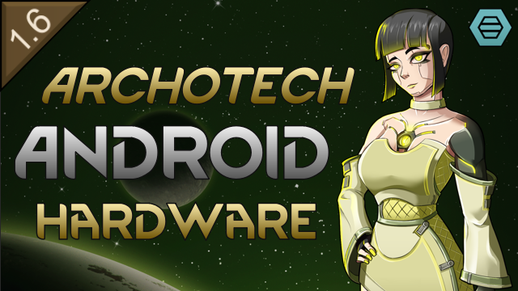

# Archotech Android Hardware

> Archotech-tier reactors and implants for Vanilla Races Expanded androids

<!-- Steam badges, added on first Workshop publish with WORKSHOP_ID from About/PublishedFileId.txt:

-->

A RimWorld mod that adds a range of archotech-tier body parts for androids from [Vanilla Races Expanded - Android](https://steamcommunity.com/sharedfiles/filedetails/?id=2975771801).

## About

True archotechnology can't be manufactured by human hands — but a salvaged vanometric power cell, psychic emanator, or violence generator can be dismantled, re-housed, and wired into an android chassis. This mod adds a family of such parts: alternative reactors with distinct power economies, plus archotech implants that lift the limitations androids are normally born with.

Every part is **crafted** at the Android Part Workbench (requires Archotech Androidtech research), **installed** via surgery, and **recoverable** — implants can be surgically removed and reactors swapped out, and either way the part comes back as an intact item.

## Parts

### Reactors

- **Vanometric reactor** — a permanent power cell built around archotech quantum-foam energy extraction. Removes the android's power need entirely: no drain, no replacements, no colonist shutting down mid-surgery.
- **Thanatic reactor** — fed by the echoes of violent death. Each humanlike kill its host delivers recharges the cell, and brief overflows bleed into a combat overcharge. Starved of kills it drains faster than a standard reactor — and when it runs dry, its host dies (the reactor ejects intact, recharged once more, to await its next host). *(Crafting requires Anomaly DLC or Vanilla Expanded - Power.)*
- **Grav reactor** — adapted from gravship engine technology, partially recharged (half a tank by default, configurable) whenever its host takes part in a gravship launch. Useless to a colony that never leaves the rim; indispensable to one that lives on the move. *(Crafting requires Odyssey DLC.)*

### Other hardware

- **Psychic transceiver** — bridges an android's natural inertness to psychic phenomena, granting psychic awareness and a sensitivity boost.
- **Archotech mnemocore** — re-architects android memory onto self-organizing archotech substrate. Removes the memory need entirely and ends memory degradation.
- **Neutrosynthesizer** — an android kidney that actively synthesizes fresh neutroamine, restoring neutro loss far faster than the base synthesis subroutine.

## Requirements

- RimWorld 1.6
- Biotech DLC
- [Vanilla Races Expanded - Android](https://steamcommunity.com/sharedfiles/filedetails/?id=2975771801)

**Optional** — these gate crafting recipes only; the rest of the mod loads fine without them:

- Odyssey DLC — required to craft the grav reactor
- Anomaly DLC — required to craft the thanatic reactor from a shard
- [Vanilla Expanded - Power](https://steamcommunity.com/sharedfiles/filedetails/?id=2062943477) — alternatively, salvage thanatic reactors from an archotech violence generator

## Installation

**Steam Workshop:** Subscribe to the mod (link TBD)

**Manual:** Download the latest release and extract to your RimWorld `Mods/` folder.

## Compatibility

- Safe to add to existing saves
- Safe to remove (surgically remove any installed parts first to avoid orphaned hediffs)
- Compatible with other VREA addons

## Contributing

Bug reports and feature requests welcome on [GitHub Issues](https://github.com/sam-hunt/ArchotechAndroidHardware/issues).
Please attach any relevant logs/stack traces/mod lists etc.

Translations are welcome too — see [CONTRIBUTING.md](CONTRIBUTING.md). For development setup, see [CLAUDE.md](CLAUDE.md).

## Credits

- **Author:** Sam Hunt
- **Built for:** [Vanilla Races Expanded - Android](https://steamcommunity.com/sharedfiles/filedetails/?id=2975771801) by Oskar Potocki & the Vanilla Expanded team
- **Tools:** [Claude Code](https://claude.ai/code)
